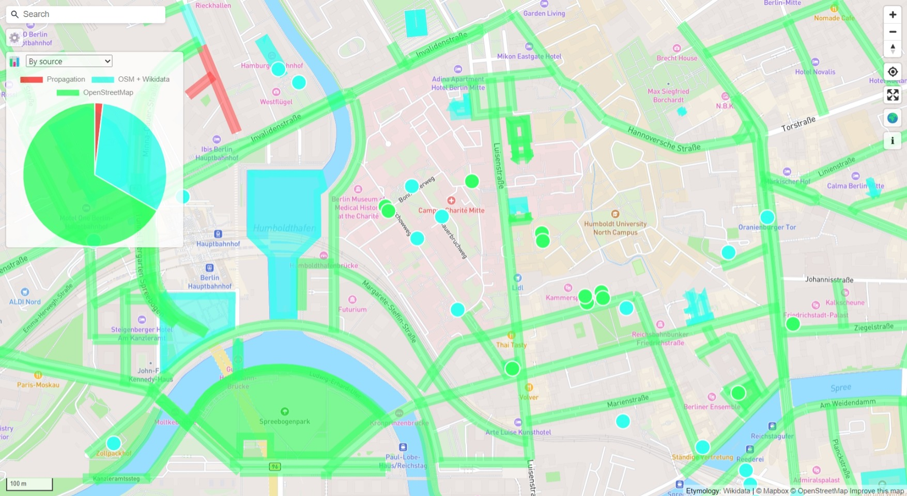
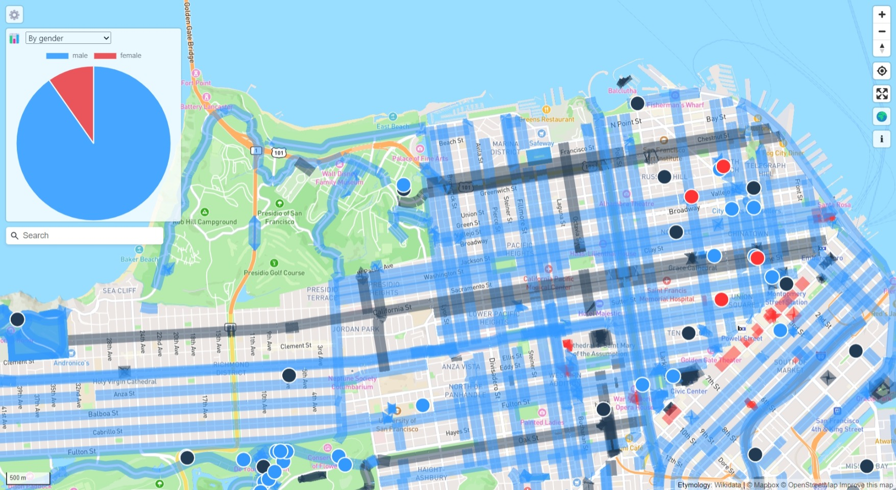
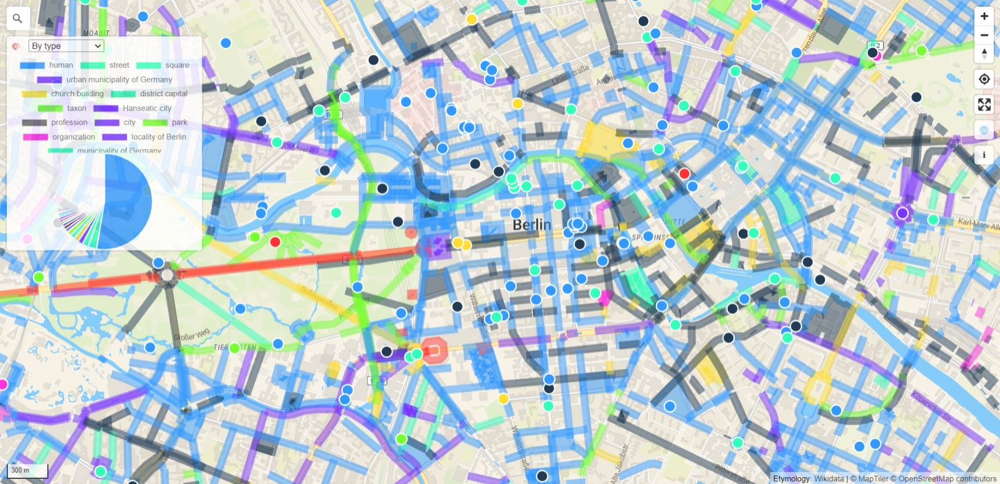
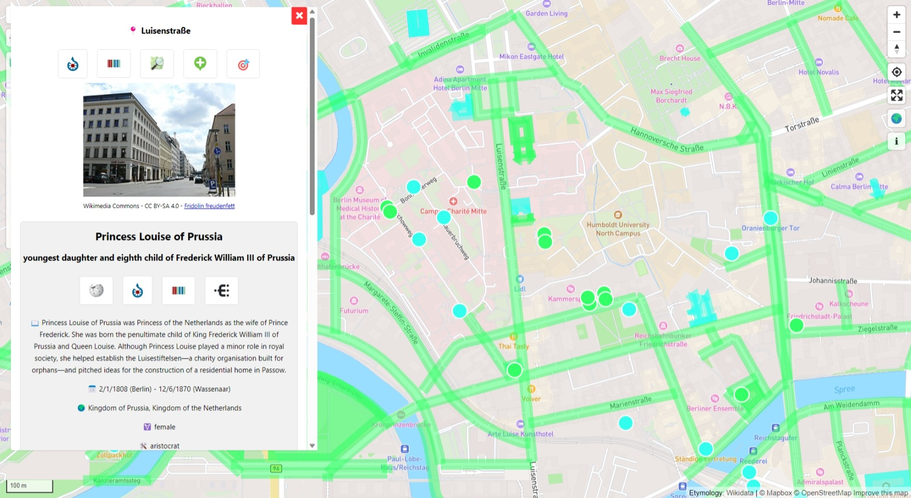
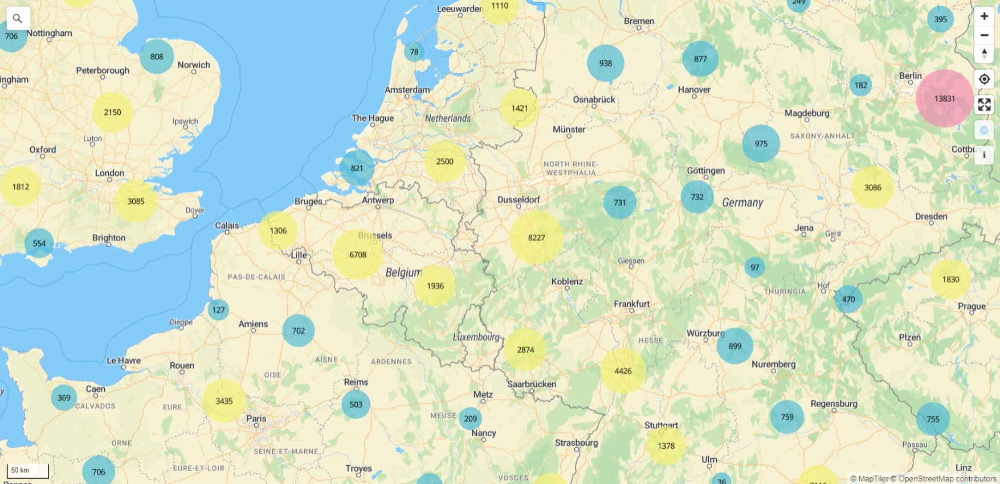

# Open Etymology Map

Interactive map that shows the etymology of names of streets and points of interest based on OpenStreetMap and Wikidata.

## Used technologies

- [OpenStreetMap](https://www.openstreetmap.org/about) and its [`name:etymology:wikidata`](https://wiki.openstreetmap.org/wiki/Key:name:etymology:wikidata) and [`subject:wikidata`](https://wiki.openstreetmap.org/wiki/Key:subject) tags
- [Wikidata](https://www.wikidata.org/wiki/Wikidata:Introduction) and its [SPARQL Query Service](https://www.wikidata.org/wiki/Wikidata:SPARQL_query_service)
- [Overpass API](https://wiki.openstreetmap.org/wiki/Overpass_API)
- [MapLibre GL JS](https://maplibre.org/projects/maplibre-gl-js/)

This project is based on [OSM-Wikidata Map Framework](https://gitlab.com/openetymologymap/osm-wikidata-map-framework), for more details see its [README](https://gitlab.com/openetymologymap/osm-wikidata-map-framework/-/blob/main/README.md) and [CONTRIBUTING guide](https://gitlab.com/openetymologymap/osm-wikidata-map-framework/-/blob/main/CONTRIBUTING.md).

## Screenshots
Color grouping by source:

Color grouping by gender:

Color grouping by type:

Etymology details:

Cluster view:

